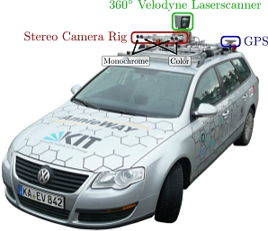

# kitti
Karlsruhe driving dataset analysis

http://www.cvlibs.net/datasets/kitti/

**2011_09_26_drive_0001 (0.4 GB)**

## Resources:
* https://github.com/utiasSTARS/pykitti
* https://pointclouds.org/